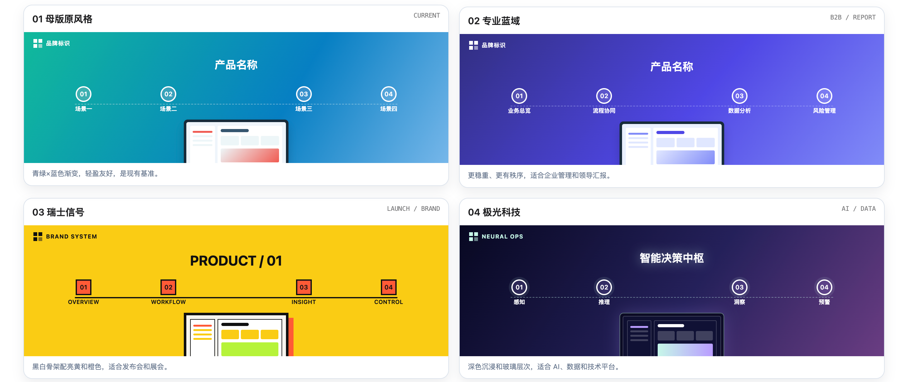
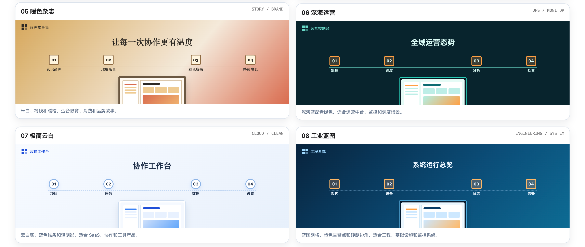

# Interactive Demo Builder

一个用于规划和生成产品宣传交互演示的通用模板与工作规范。

它会根据产品功能、受众、使用场合、品牌色、Logo、截图和视频素材，生成可键盘控制、可自动播放的产品演示页面，并同时输出演示配置表和视频接入说明。

## 主题预览

所有主题保留同一套演示骨架：首页总览、场景介绍、功能播放和键盘控制；仅切换颜色、字体、圆角、阴影、背景、标题和卡片风格。





| 主题 | 适合用在什么项目 |
|---|---|
| 母版原风格 | 通用宣传演示、延续现有项目视觉 |
| 专业蓝域 | 企业管理、政企项目、领导汇报 |
| 瑞士信号 | 发布会、展会、品牌宣传 |
| 极光科技 | AI、数据智能、技术平台 |
| 暖色杂志 | 教育、消费、文化、品牌故事 |
| 深海运营 | 运营中台、监控、调度场景 |
| 极简云白 | SaaS、协作、工具产品 |
| 工业蓝图 | 工程、基础设施、系统监控 |

## 功能

- 保留“首页总览 → 场景介绍 → 功能播放”的演示结构
- 支持 `ArrowRight` 下一步、`ArrowDown` 自动播放、`ArrowLeft` 上一步、`Escape` 停止播放
- 支持视频素材和无视频时的占位回退时长
- 支持 8 套可复用视觉主题：
  - `original-template`：母版原风格
  - `saas-indigo`：专业蓝域
  - `swiss-signal`：瑞士信号
  - `aurora-tech`：极光科技
  - `editorial-warm`：暖色杂志
  - `deep-ops`：深海运营
  - `cloud-minimal`：极简云白
  - `blueprint`：工业蓝图

## 使用方式

这个项目可以作为以下内容使用：

- 支持 `SKILL.md` 规范的 AI 助手工作技能
- 产品宣传演示的 HTML 母版
- 产品经理、设计师和开发者的演示制作参考

如果你的 AI 工具支持导入 Skill，将整个仓库作为一个技能目录导入即可；也可以直接复制 HTML 母版，根据项目内容修改 `scenes`、`units`、主题和视频路径。

## 使用示例

```text
用 Interactive Demo Builder 做一个“项目名称”的 3 分钟宣传演示。
受众是公司领导，重点展示数据看板、审批流程和风险预警。
主题使用 saas-indigo。
素材在：/你的素材文件夹
```

如果没有指定主题，Skill 会根据受众、场景、行业和品牌规范自动推荐；有明确品牌规范时，品牌规范优先。

## 文件说明

- `SKILL.md`：Skill 主说明和工作流程
- `assets/宣传交互演示母版/宣传交互演示母版.html`：可复制的 HTML 母版
- `references/模板配置说明.md`：主题、内容、视频和时长配置说明
- `docs/images/`：README 使用的 8 套主题预览图

## 许可证

本项目使用 MIT License，允许个人和商业项目使用、修改和分发。
